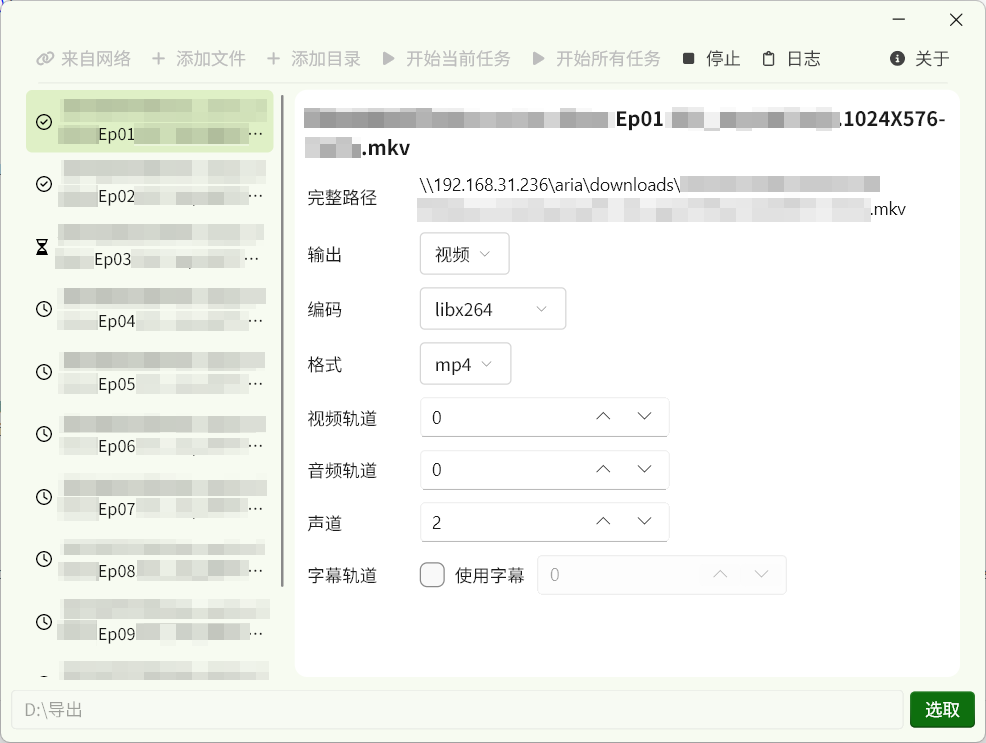
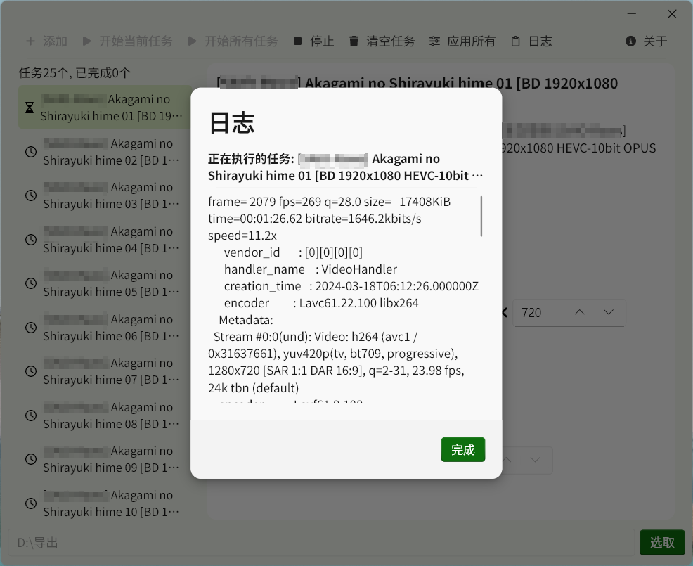

# FFmpeg GUI

FFmpeg的图形化界面

> [!WARNING]
> 注意编码和格式的组合，并不是所有的编码和格式的组合都可以成功编码

## 截图

## 更新日志

### 0.3.0 (2024/11/23)
- 添加清空任务列表的功能
- 改进界面布局和右键菜单
- 修复一些字体错误
- 修复指定视频大小出现显示错误的问题

过去的版本

### 0.2.5 (2024/11/20)
- 添加应用配置到所有任务
- 添加许可证页

### 0.2.4 (2024/11/12)
- 修复日志字体错误的问题

### 0.2.3 (2024/11/9)
- 添加指定视频分辨率功能
- 添加任务数量统计
- 添加多选文件的支持
- 修复一个图标问题

### 0.2.2 (2024/11/8)
- 修复日志编码问题

### 0.2.1 (2024/11/7)
- 显示进行中/已完成/等待中状态指示
- 忽略已经完成的任务

### 0.2.0 (2024/11/6)
- 添加从网络添加任务
- 添加执行所有任务
- 添加记住导出目录的功能
- 添加输出视频/音频选择
- 完善日志输出

### 0.1.0 (Beta, 2024/11/4)
- 第一个版本

